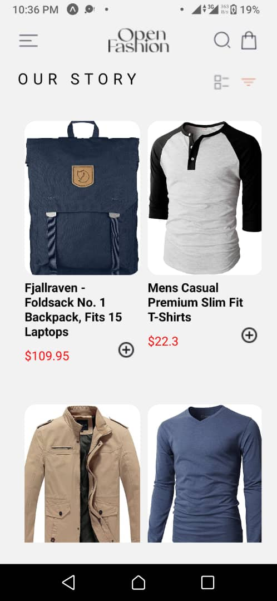
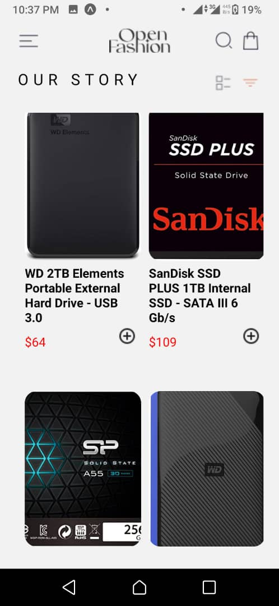
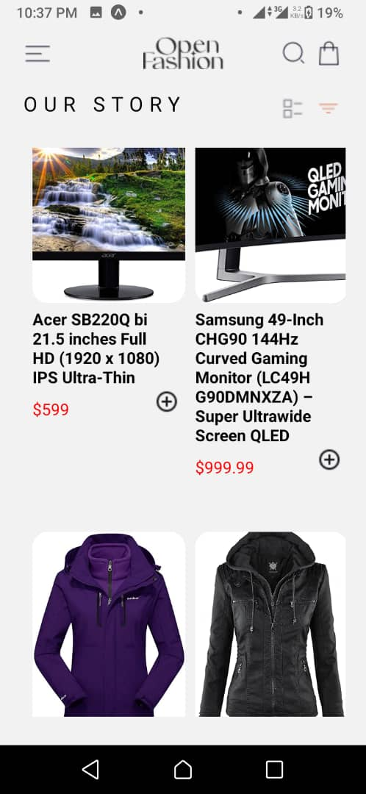
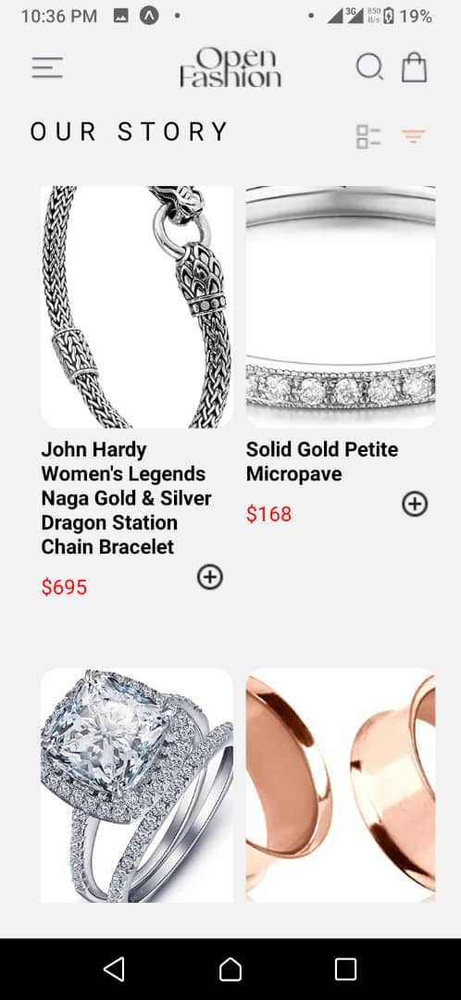
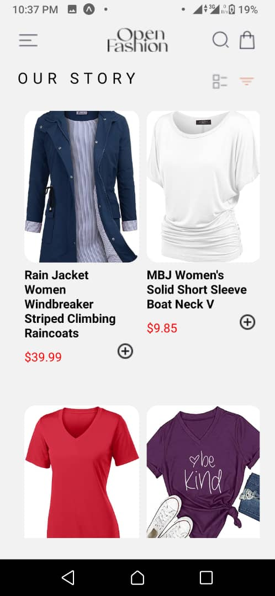

# rn-assignment7-11348840

# Shopping Center Mobile App

## Overview
The Shopping Center mobile app is a React Native application that allows users to view a list of products, view product details, add products to a cart, and view and manage the items in their cart. This project is a continuation and enhancement of previous assignment 6, incorporating additional functionalities and improved user experience.

## Features
- Home Screen: Displays a list of available products.
- Product Detail Screen: Shows detailed information about a selected product.
- Cart Screen: Displays items added to the cart and allows users to remove items.
- Navigation Drawer: Accessible through a swipe gesture or button for easy navigation.
- Add to Cart: Allows users to add products to their cart.
- Remove from Cart: Allows users to remove products from their cart.
- Fetch Data: Fetches product data from an external API.
- Asynchronous Operations: Manages data fetching and storage asynchronously.
- Local Storage: Stores selected items locally on the device using AsyncStorage.

## Installation
1. Clone the repository: using git clone

2. Install the dependencies: npm install

3. Start the project: npm start


2. Use the Expo app on your mobile device or an emulator to scan the QR code displayed in the terminal or on the web page that opens.

## Project Structure
```
project-root/
├── assets/
│   └── images/
├── screens/
│   ├── HomeScreen.js
│   ├── ProductDetailScreen.js
│   └── CartScreen.js
├── App.js
├── package.json
├── babel.config.js
├── app.json
├── .gitignore
└── node_modules/
```

## Design Choices
- **React Navigation**: Chosen for its simplicity and flexibility in managing navigation within the app.
- **AsyncStorage**: Used for local storage to persist cart items across app sessions.
- **FlatList**: Used for efficient rendering of the product list, with performance optimizations such as `React.memo`, `initialNumToRender`, `maxToRenderPerBatch`, and `getItemLayout`.

## Implementation Details
### HomeScreen
- Fetches a list of products from an external API using Axios.
- Displays the list using a FlatList for efficient rendering.
- Includes buttons to view product details and add products to the cart.

### ProductDetailScreen
- Displays detailed information about a selected product.
- Includes a button to add the product to the cart.

### CartScreen
- Displays items added to the cart using a FlatList.
- Includes buttons to remove items from the cart.
- Fetches and updates cart items from AsyncStorage.

### Navigation
- Uses a stack navigator for screen navigation.
- Includes a drawer navigator for accessing different parts of the app.

## Screenshots
Include screenshots of your app here to showcase its functionality and design.











## Conclusion
This project demonstrates the implementation of a simple yet functional shopping cart application using React Native. It highlights the use of modern React Native features, performance optimizations, and best practices for state and data management.
